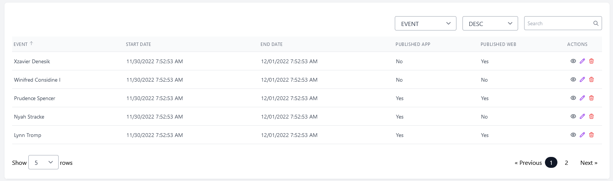
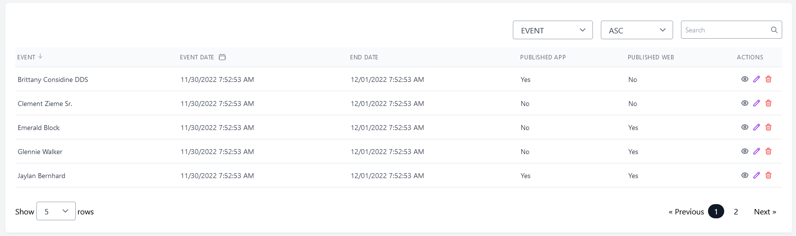

# Inertia js datatable for Laravel

[](https://www.npmjs.com/package/@velitsol/inertia-vue-datatable)
[](https://opensource.org/licenses/MIT)

This package is written in vue 3 with the support of Inertia js for Laravel projects.

## Features

- Global search
- Sorting column
- Pagination (support for Eloquent)

## Compatibility

- Vue 3
- Inertia.js
- Tailwind CSS
- Laravel 9

## Limitations

- Not responsive for mobile display

## Installation

You can install the package via npm:

```bash
npm install @velitsol/inertia-vue-datatable
```

## Usage

#### Register in app.js

In your app.js file, you can register the component globally to make it available across your entire Vue.js application.

```javascript
import { InertiaDataTable } from "@velitsol/inertia-vue-datatable";

createApp(App).component("InertiaDataTable", InertiaDataTable).mount("#app");
```

By registering the component globally, you can use it in any Vue component template without the need for importing it specifically.

#### Register locally in a Vue component

If you prefer to register the component locally in a specific Vue component, you can do so as follows:

```javascript
import { InertiaDataTable } from "@velitsol/inertia-vue-datatable";

export default {
  components: {
    InertiaDataTable,
  },
  // ...
};
```

## Props

| Prop      | Type     | Default                   | Description                        |
| --------- | -------- | ------------------------- | ---------------------------------- |
| `records` | `object` | `null`                    | Paginated response from Laravel    |
| `columns` | `object` | `null`                    | Heading cloumns of table           |
| `actions` | `array`  | `['view','edit','delete]` | Actions of table                   |
| `_route`  | `string` | `null`                    | Route prop is required for actions |

## Slots

| Slot       | Return            | Description         |
| ---------- | ----------------- | ------------------- |
| heading    | `column object`   | Column heading      |
| row        | `record object`   | Table row           |
| column     | `record object`   | Table column        |
| action     | `record object`   | Table action column |
| pagination | `links object`    | Table pagination    |
| empty      | No Data Available | Table empty         |

## Examples

#### General

```javascript
<script>
import { reactive } from "vue";

export default {

  props: ["events"],
  setup(props) {

    /**
     *  key should database field name
     *  heading is column heading in datatable
     *  sortable represents a column should sortable or not
     *  format callback : it returns single
     *  _record callback : it returns row
     */
 const dataTableColumns = reactive([
      { key: "name", heading: "event", sortable: 1 },
      {
        key: "start_date",
        heading: "Start Date",
        sortable: 1,
        format: function (v) {
          return moment(v).format("MM/DD/YYYY h:mm:ss A");
        },
      },
      {
        key: "end_date",
        heading: "End Date",
        sortable: 1,
        format: function (v) {
          return moment(v).format("MM/DD/YYYY h:mm:ss A");
        },
      },
      {
        key: "published_app",
        heading: "Published App",
        sortable: 1,
        format: function (v) {
          return v === 1 ? "Yes" : "No";
        },
      },
      {
        key: "published_web",
        heading: "Published Web",
        sortable: 0,
        format: function (v) {
          return v === 1 ? "Yes" : "No";
        },
      },
    ]);

    return { dataTableColumns };
  },
};
</script>

<template>
     <inertia-data-table
          :records="events"
          :columns="dataTableColumns"
          :_route="'events'"
          :actions="['view', 'edit', 'delete']">
          <template #heading-start_date="{ column }">  Event Start Date </template>
      </inertia-data-table>
</template>

```



#### Heading slot

```javascript

<template>
     <inertia-data-table
          :records="events"
          :columns="dataTableColumns"
          :_route="'events'"
          :actions="['view', 'edit', 'delete']">

             /**
             *  Syntax : #heading-column_key
             *  Return : It returns column object
             *  Description : You can add any icon with column heading.
             */

         <template #heading-start_date="{ column }">
            <div class="flex space-x-2 w-full">
              <span>Event Date</span>
              <span>
                <svg
                  xmlns="http://www.w3.org/2000/svg"
                  fill="none"
                  viewBox="0 0 24 24"
                  stroke-width="1.5"
                  stroke="currentColor"
                  class="w-4 h-4"
                >
                  <path
                    stroke-linecap="round"
                    stroke-linejoin="round"
                    d="M6.75 3v2.25M17.25 3v2.25M3 18.75V7.5a2.25 2.25 0 012.25-2.25h13.5A2.25 2.25 0 0121 7.5v11.25m-18 0A2.25 2.25 0 005.25 21h13.5A2.25 2.25 0 0021 18.75m-18 0v-7.5A2.25 2.25 0 015.25 9h13.5A2.25 2.25 0 0121 11.25v7.5"
                  />
                </svg>
              </span>
            </div>
          </template>

      </inertia-data-table>
</template>

```



#### Column slot

```javascript
<script>
import { reactive } from "vue";

export default {

  props: ["events"],
  setup(props) {

    /**
     *  key should database field name
     *  heading is column heading in datatable
     *  sortable represents a column should sortable or not
     *  format callback : it returns single
     *  _record callback : it returns row
     */
    const dataTableColumns = reactive([
     { key: "name", heading: "event", sortable: 1 },
      {
        key: "start_date",
        heading: "start_date",
        sortable: 1,
        format: function (v) {
          return moment(v).format("MM/DD/YYYY h:mm:ss A");
        },
      },
      {
        key: "end_date",
        heading: "End Date",
        sortable: 1,
        format: function (v) {
          return moment(v).format("MM/DD/YYYY h:mm:ss A");
        },
      {
        key: "published_app",
        heading: "Published App",
        sortable: 1,
      },
      {
        key: "published_web",
        heading: "Published Web",
        sortable: 0,
      },
    ]);

    const changeStatus=(record)=>{
      console.log(record)
    }

    return { dataTableColumns,changeStatus };
  },
};
</script>

<template>
     <inertia-data-table
          :records="events"
          :columns="dataTableColumns"
          :_route="'events'"
          :actions="['view', 'edit', 'delete']">

             /**
             *  Syntax : #column-column_key
             *  Return : It returns record object
             *  Description : You can add any icon with column heading.
             */

            <template #column-published_web="{ record }">
               <button @click="changeStatus(record)" >{{ record.published_web }}</button>
            </template>

      </inertia-data-table>
</template>

```

#### Action slot

```javascript
<script>
import { reactive } from "vue";

export default {

  props: ["events"],
  setup(props) {

    /**
     *  key should database field name
     *  heading is column heading in datatable
     *  sortable represents a column should sortable or not
     *  format callback : it returns single
     *  _record callback : it returns row
     */
    const dataTableColumns = reactive([
     { key: "name", heading: "event", sortable: 1 },
      {
        key: "start_date",
        heading: "start_date",
        sortable: 1,
        format: function (v) {
          return moment(v).format("MM/DD/YYYY h:mm:ss A");
        },
      },
      {
        key: "end_date",
        heading: "End Date",
        sortable: 1,
        format: function (v) {
          return moment(v).format("MM/DD/YYYY h:mm:ss A");
        },
      {
        key: "published_app",
        heading: "Published App",
        sortable: 1,
      },
      {
        key: "published_web",
        heading: "Published Web",
        sortable: 0,
      },
    ]);

    const changeStatus=(record)=>{
      console.log(record)
    }

    const viewEventTickets=(record)=>{
     console.log(record)
    }

    return { dataTableColumns,changeStatus ,viewEventTickets};
  },
};
</script>

<template>
     <inertia-data-table
          :records="events"
          :columns="dataTableColumns"
          :_route="'events'"
          :actions="['view', 'edit', 'delete','view_tickets']">

             /**
             *  Syntax : #action-name
             *  Return : It returns record object
             *  Description : You can override default actions (view,edit,delete) or add new action
             */

            <template #column-published_web="{ record }">
               <button  @click="changeStatus(record)" >{{ record.published_web }}</button>
            </template>

            template #action-view_tickets="{ record }">
               <button @click="viewEventTickets(record)" >Tickets</button>
            </template>

      </inertia-data-table>
</template>

```

````
#### Empty slot

```javascript
<script>
import { reactive } from "vue";

export default {

  props: ["events"],
  setup(props) {

    /**
     *  key should database field name
     *  heading is column heading in datatable
     *  sortable represents a column should sortable or not
     *  format callback : it returns single
     *  _record callback : it returns row
     */
    const dataTableColumns = reactive([
     { key: "name", heading: "event", sortable: 1 },
      {
        key: "start_date",
        heading: "start_date",
        sortable: 1,
        format: function (v) {
          return moment(v).format("MM/DD/YYYY h:mm:ss A");
        },
      },
      {
        key: "end_date",
        heading: "End Date",
        sortable: 1,
        format: function (v) {
          return moment(v).format("MM/DD/YYYY h:mm:ss A");
        },
      {
        key: "published_app",
        heading: "Published App",
        sortable: 1,
      },
      {
        key: "published_web",
        heading: "Published Web",
        sortable: 0,
      },
    ]);

    const changeStatus=(record)=>{
      console.log(record)
    }

    const viewEventTickets=(record)=>{
     console.log(record)
    }

    return { dataTableColumns,changeStatus ,viewEventTickets};
  },
};
</script>

<template>
     <inertia-data-table
          :records="events"
          :columns="dataTableColumns"
          :_route="'events'"
          :actions="['view', 'edit', 'delete','view_tickets']">

             /**
             *  Syntax : #action-name
             *  Return : It returns record object
             *  Description : You can override default actions (view,edit,delete) or add new action
             */

            <template #column-published_web="{ record }">
               <button  @click="changeStatus(record)" >{{ record.published_web }}</button>
            </template>

            template #action-view_tickets="{ record }">
               <button @click="viewEventTickets(record)" >Tickets</button>
            </template>

              template #empty>
                <h3> No data available in table. </h3>
            </template>

      </inertia-data-table>
</template>

````

## License

This project is licensed under the [MIT License](LICENSE.md). Make sure to mention the license type and provide a link to the full license file.

## Credits

If your package includes code or assets from other projects, provide proper attribution or credits to the original authors or sources.

## Support

If users encounter any issues or have questions, provide instructions on how they can reach out for support. This can be through a GitHub issue tracker, email, or any other communication channel.
